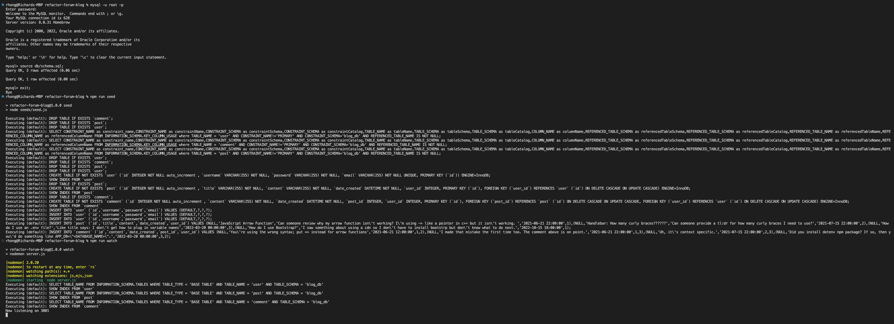
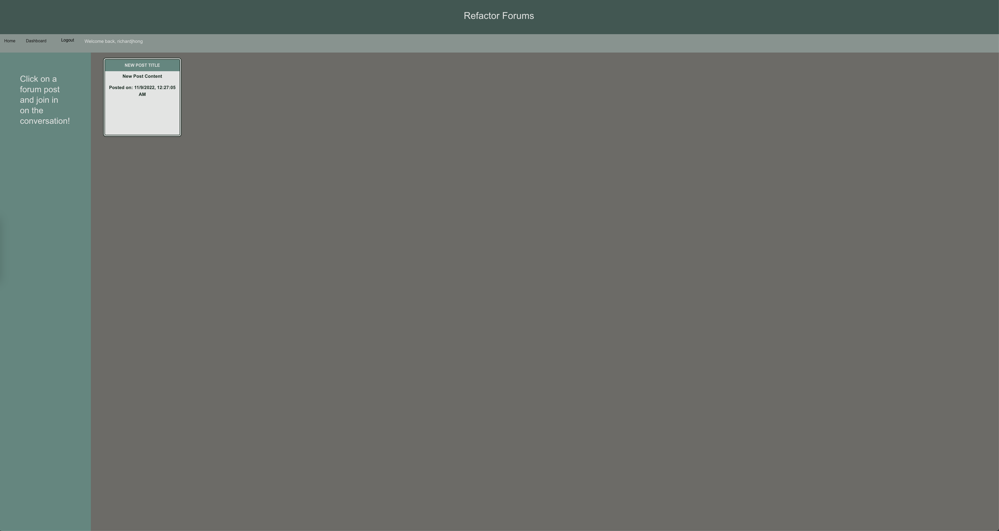

# Refactor Forum Blog

[](https://opensource.org/licenses/MIT)

## Description
This app imitates a forum in which users can post and comment on different threads.

## Technologies
This app is built with [Node.js](https://nodejs.org/en/), [Express](https://expressjs.com/) (version 4.18.2), [mysql2](https://www.npmjs.com/package/mysql2) (version 2.2.5), [bcrypt](https://github.com/kelektiv/node.bcrypt.js) (version 5.1.0), [dotenv](https://github.com/motdotla/dotenv) (version 16.0.3), [connect-session-sequelize](https://github.com/mweibel/connect-session-sequelize) (version 7.1.5), [express-handlebars](https://github.com/express-handlebars/express-handlebars) (version 6.0.6), [sequelize](https://github.com/sequelize/sequelize) (version 6.25.3), [express-session](https://github.com/expressjs/session) (version 1.17.3), and [nodemon](https://github.com/remy/nodemon) (version 2.0.20).

## Table of Contents
  - [Installation](#installation)
  - [Usage](#usage)
  - [Architecture](#architecture)
  - [Live deployment](#deployment)
  - [Screenshot](#screenshot)
  - [License](#license)
  - [Improvements](#improvements)
  - [Questions](#questions)

## Installation

The user needs to have MySQL Server installed; instructions can vary based on the operating system. The following command can show if it is already installed:

```
mysql --version
```
After cloning the repository, the user should run the following command within the terminal:
```
npm install
```
Afterwards check towards the bottom within package.json; the user should see the following within the dependencies object:

```
...
  "dependencies": {
    "bcrypt": "^5.1.0",
    "connect-session-sequelize": "^7.1.5",
    "dotenv": "^16.0.3",
    "express": "^4.18.2",
    "express-handlebars": "^6.0.6",
    "express-session": "^1.17.3",
    "mysql2": "^2.3.3",
    "nodemon": "^2.0.20",
    "sequelize": "^6.25.3"
  }
```

User should then create an .env file at the root level with the following variables:
```
DB_NAME="blog_db"
DB_USER="root"
DB_PASSWORD="<INSERT PASSWORD HERE>"
HOST="localhost"
```

## Usage
After installing packages, the user should run the following commands within the terminal:
```
mysql -u root -p
```
After inserting password, the user should run the following commands while in mysql to create the database:
```
source db/schema.sql;
exit;
```

Next, the user should run the following:
```
npm run seed
npm run watch
```
After running the command, the user should expect to see something similar within his/her terminal:



## Architecture
For this program, the logic is mostly spread amongst several files: 
  * controllers
    - API routes are called within here
  * models
    - contains the relations and models associations used by sequelize.
  * public
    - css contains a jass.css and style.css file for styling
    - js contains the script files used within the view handlebars
  * seeds
    - contains mock data for seeding
  * utils 
    - contains an auth.js used with bcrypt for password encryption/authentication and a helpers.js for formatting time and dates
  * views
    - contains handlebar templates for html
  * server.js
    - contains logic and code to creat a session and use of middleware, etc. for when using the npm run watch script.
    
## Deployment
[Deployed on heroku](https://refactor-forums.herokuapp.com/dashboard)

## Screenshot


## License
This app was licensed under the MIT License.

## Improvements
To be frank the frontend styling could use more work. Also there are some logical components that could be better handled with better understanding of handlebars but for now, the code is sufficient.

## Questions
Questions, comments, concerns? Send me an email at rhong24@gmail.com.

